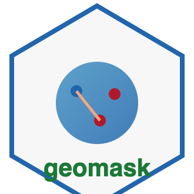

# geomask 

<!-- badges: start -->
[](https://github.com/JDConejeros/geomask/actions/workflows/R-CMD-check.yaml)
[](https://codecov.io/gh/JDConejeros/geomask)
[](https://github.com/JDConejeros/geomask/actions/workflows/pkgdown.yaml)
[](https://www.repostatus.org/#active)
[](https://lifecycle.r-lib.org/articles/stages.html)
[](https://orcid.org/0000-0003-3402-4361)
[](LICENSE)
<!-- badges: end -->

**geomask** is a unified R framework to apply, evaluate, and document **geomasking** (spatial masking) on sensitive georeferenced point data. It targets epidemiology, public health, and social science workflows using [`sf`](https://r-spatial.github.io/sf/) and optional integration with [`terra`](https://rspatial.org/terra/), [`spdep`](https://r-spatial.github.io/spdep/), and [`ggplot2`](https://ggplot2.tidyverse.org/).

> Documentación en español: ver [README_ES.md](README_ES.md) y [vignettes](https://jdconejeros.github.io/geomask/articles/).

## Installation

```r
# install.packages("devtools")
devtools::install_github("JDConejeros/geomask")
```

**System dependencies:** R ≥ 4.1, GDAL/PROJ/GEOS (for `sf`).

## Quick example

```r
library(geomask)
library(sf)

data(geomask_pts)
data(geomask_boundary)

masked <- mask_donut(geomask_pts, min_r = 400, max_r = 1200, seed = 42)

privacy_k_anonymity(masked, r = 500)
privacy_disclosure_risk(geomask_pts, masked)
utility_spatial_stats(geomask_pts, masked)

mask_report(
  geomask_pts, masked,
  method = "donut",
  parameters = list(min_r = 400, max_r = 1200, seed = 42)
)
```

## Methods

| Category | Functions |
|----------|-----------|
| Masking | `mask_random_perturbation()`, `mask_donut()`, `mask_gaussian()`, `mask_density_displacement()`, `mask_adaptive_aggregation()`, `mask_location_swapping()`, `mask_graph_k_component()`, `mask_context_aware()` |
| Privacy | `privacy_k_anonymity()`, `privacy_disclosure_risk()`, `privacy_location_protection()` (LPM) |
| Utility | `utility_spatial_stats()`, `utility_cluster_detection()`, `utility_epi_summary()`, `utility_summary()` |
| Workflow | `geomask_config()`, `apply_mask()`, `mask_report()` |

## Example data (Santiago RM)

Synthetic epidemiological points and simplified communal boundaries derived from open DEIS health facility locations (Región Metropolitana only):

- `geomask_pts`, `geomask_boundary`, `geomask_services`, `geomask_pop`

Regenerate locally: `source("data-raw/prepare_data.R")` (requires `RC-ref/Data`).

## Dependencies

**Imports:** `sf`, `units`, `dplyr`, `rlang`, `cli`, `stats`, `utils`

**Suggests (vignettes / optional features):** `testthat`, `roxygen2`, `knitr`, `rmarkdown`, `pkgdown`, `ggplot2`, `spdep`, `terra`, `tmap`, `yaml`, `covr`, `hexSticker`

## Resources

- [R Packages (2e)](https://r-pkgs.org/)
- [Desarrollo de paquetes (EEA / Diego Koz)](https://diegokoz.github.io/EEA2019/pkg-dev/desarrollo_paquetes.nb.html)
- [rOpenSci contributing guide](https://contributing.ropensci.org/welcome.html)
- [rOpenSci packages devguide](https://devguide.ropensci.org/)

## Contributing

Please read [CONTRIBUTING.md](CONTRIBUTING.md) and [CODE_OF_CONDUCT.md](CODE_OF_CONDUCT.md).

## Citation

```r
citation("geomask")
```

## Author

**José Daniel Conejeros** · [jd-conejeros.com](https://jd-conejeros.com/) · [GitHub](https://github.com/JDConejeros)
